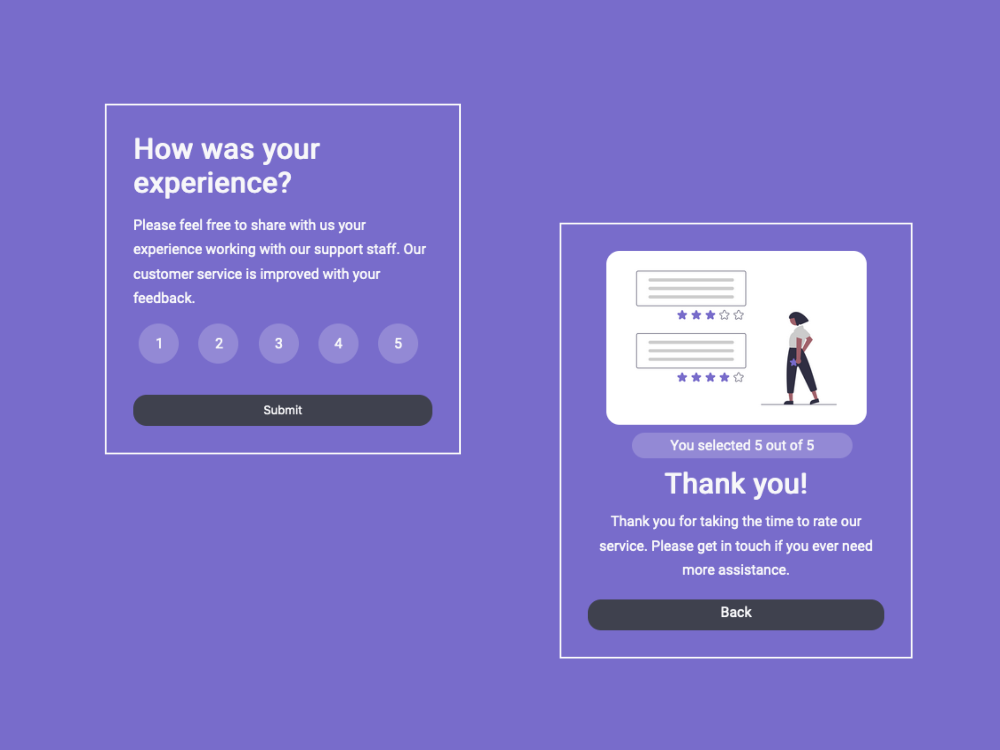

# Interactive-Rating-System
A simple interative form that lets the user give a rating and submit it. On submit a thank you message is given showing the user their rating selection.

# Languages used
The program makes use of the following languages: HTML, CSS, and JavaScript. 

